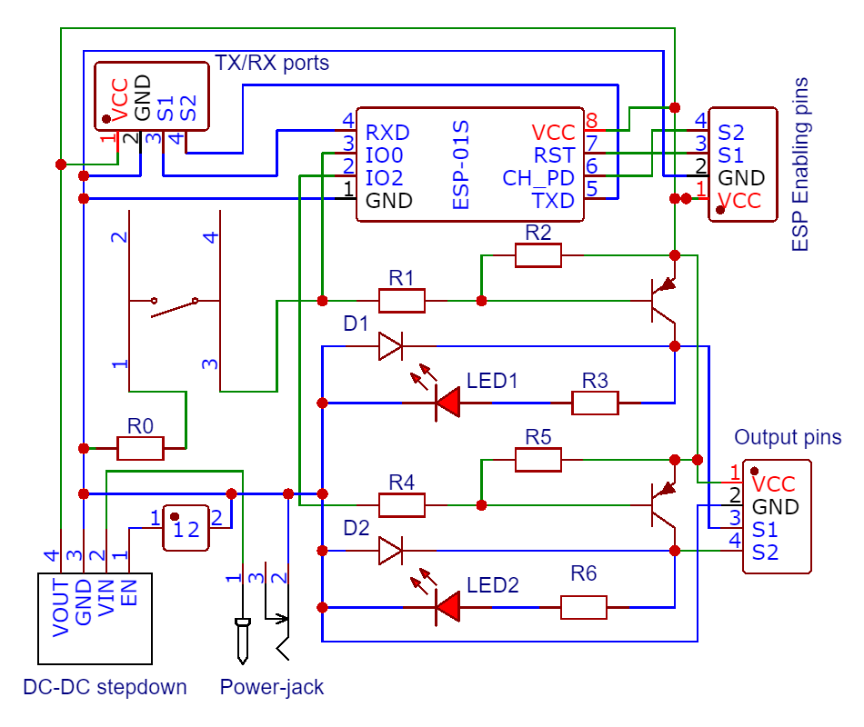
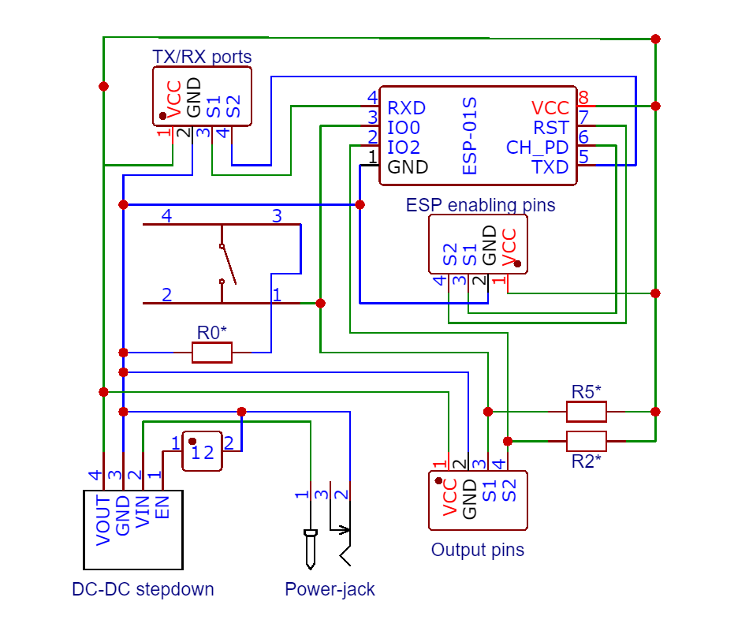
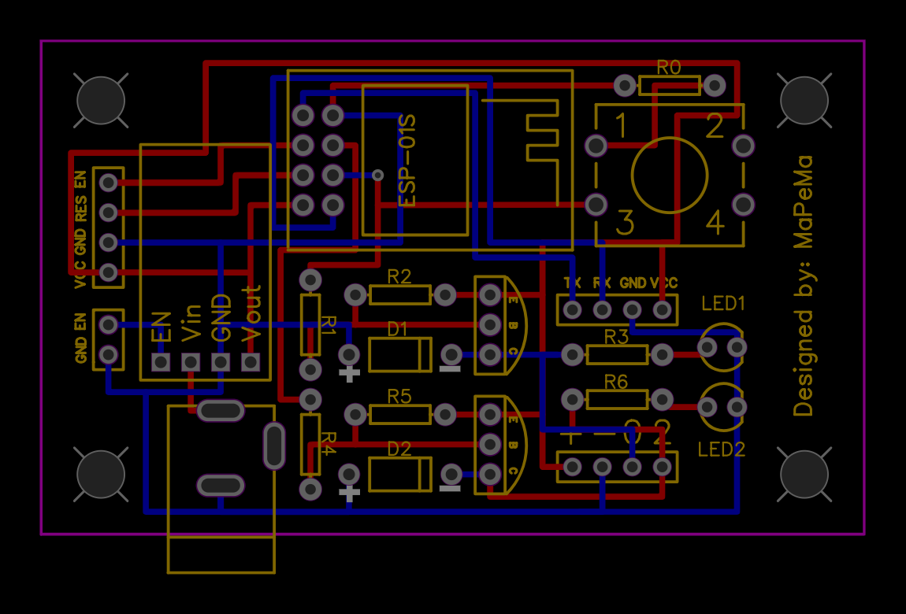
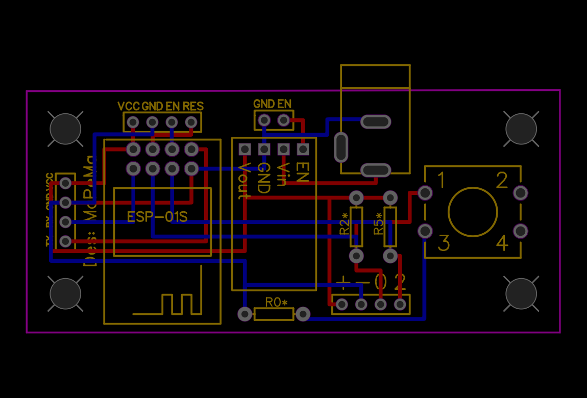
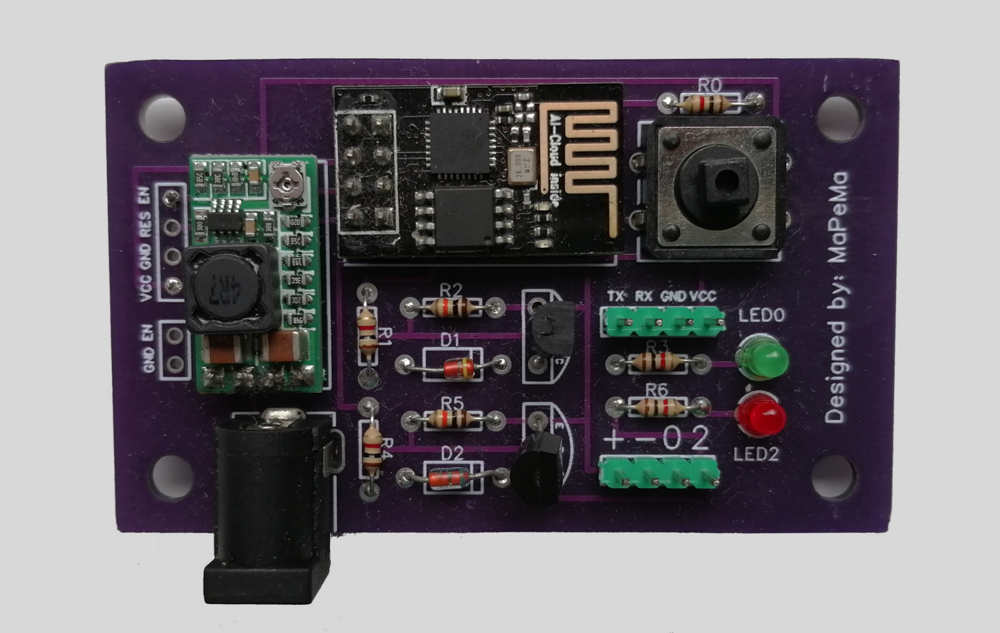
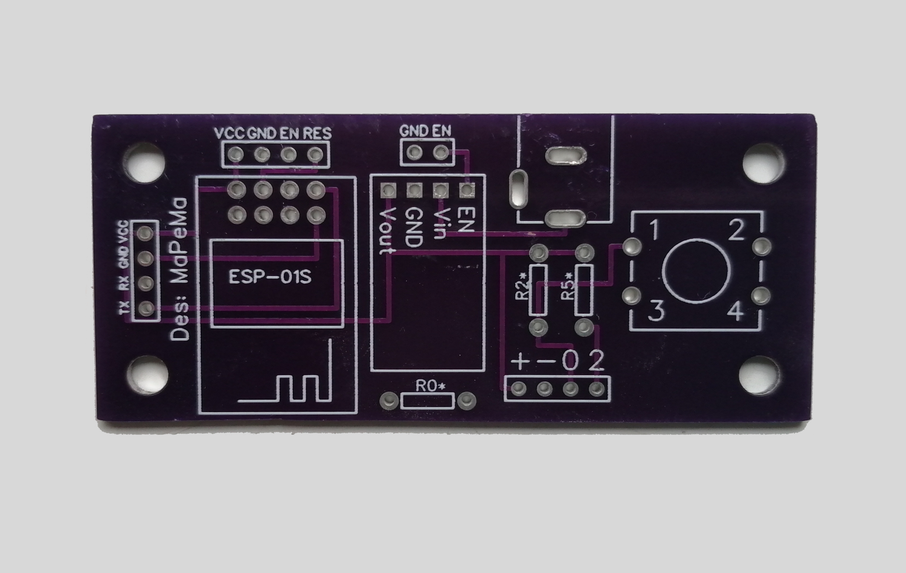

# Shutter Controller

 

   

This is a very simple solution for controlling motorized rolling shutters remotely through the world wide web by using a microcontroller. Demos for the clients can be tried out [here](https://mapema.hu/wasm/shutter-controller/HtmlJsClient.html).

## Features

### Working principle
The shutter is controlled by an [ESP8226](https://www.espressif.com/en/products/socs/esp8266), only two pins are used: one for signalling up, and one for signalling down. For both signals a seperate relay is used to turn on the power circuit to move the shutter to the proper direction (up or down).

There is no feedback for the current position of the shutter so it's only possible to operate it for a given amount of time. The speed of the rolling is assumed constant so a setting operation's duration can be calculated by the current position, the next position and by the speed.

### Zeroing
Because of this the ESP needs to be updated regularly with the correct current location. The easiest way to set this at one of the two extremities: full-up or full-down.

Also there is an automatic method which first finds one of the extremities and then sets itself to the current position.

### Timings
An additional handy function is timing the setting operations: you can schedule setting operations at specific times on the given days of the week.

### Communication, clients
The ESP acts as an HTTPS server to which the clients can POST settings and GET the current state.

There are two clients, both can be accessed from browsers: 
* [HTML+JS](./HTML+JS-client/) - pure HTML + CSS + JavaScript solution
* [Wasm client](./Wasm-client) - WASM application embedded into an HTML page

The Wasm client uses [DearImGui](https://github.com/ocornut/imgui) for the gui and it can be built as a desktop application.

The GUI becomes disabled on both platfroms when a request/shutter setting operation is in progress, this prevents the user to send multiple commands which may contradict each other. On the server side it's also ensured that two operations can't be executed at the same time as they are queued so they get executed one after other.

For images of the clients [see the gallery](#gallery).

## Gallery

   --   |   HTML+JS   |  WASM
|:----------------------:|:----------------------:|:----------------------:
Control |  | 
Timings |  | 
Zeroing |  | 

## Setting Up 
### Software

The ESP server can only be configured by hardcoding the configuration variables.
At the release section you can find the two clients' resources. 

The resources for both the HTML+JS and the WASM client have to be served from an external server as they are quite large (in the extent of the ESP). 

You can find the various solutions' building/configuration manual at their own ReadMe:
* [Server + networking parameters](./ESP8266_Server/ReadMe.md)
* [HTML+JS](./HTML+JS-client/ReadMe.md)
* [WASM](./Wasm-client/ReadMe.md)

### Hardware

As mentioned before, the engine of the shutter is turned on by a relay which is signalled by the ESP. At the top and the bottom state there have to be two limit switches which turn off the power circuits in case of accidental bad signalling by the ESP. This prevents the damaging and burning down of the engine.

The ESP I used is a simple 8-pin variant (which technically has two GPIO pins: 0 and 2 but the TX and RX pins can be reprogrammed to act as GPIO). The problem with the ESP8266 is that at startup both the 0 and 2 pins are have to be [pulled up to start normally](https://www.esp8266.com/wiki/doku.php?id=esp8266_gpio_pin_allocations#pin_functions) or in the other case it will enter sketch-flashing mode. When a relay is attached to one of the pins it gets pulled down so it will not start properly that's why a controlling circuit is needed to be implemented which solves pulling up the pins at startup.

There are two easy solutions for this problem. For both of them I designed a [simple PCB](./Controlling%20Circuit/) with [EasyEda](https://easyeda.com/).

   --   |   Solution 1   |  Solution 2
:-------------------------:|:-------------------------:|:-------------------------:
Description | The outputs are controlled with a PNP transistor. In this case the ESP signal logic is needed to be inverted programatically to get the supposed signal at the output. | The outputs are simply pulled up with a pull-up transistor. The ESP signal logic is inverted here too as well as the output signals which means the relay has to be used invertedly.
Circuit |   |  
PCB |   |  
PCB-photo |   |  

Resistor values:
* R0=1kΩ (used for pulling down GPIO0 to flash the ESP)
* R1=R4=1kΩ (used to prevent shorting when controlling the pins)
* R2=R5=10kΩ (used for pulling up pins and transistors)
* R3=R6=1kΩ (used with LEDs)

At Solution 1 the diodes serve as [flyback diodes](https://en.wikipedia.org/wiki/Flyback_diode) for the relays while the LEDs indicate the working state of the connected relay. 

For more safety it is **strongly** recommended to configure the relays in a way that they stop each other if one them is in switched state (the easiest way is adding an other pair of relays).

## Developer Notes
I tried to keep this project as simple as it can be, which I mostly succeeded to manage.

The ESP8266 was not the best choice for solving this problem as it needs the aforementioned controlling circuit. With an ESP32 this whole project could have been solved more easily. The reason I carried on with the 8266 variant is the following: solving the problem looked a great learning experience which turned out to be true. Understanding how to control the relay and designing the PCB was a satisfying experience.

## To-Do
* upload video of the operating shutter